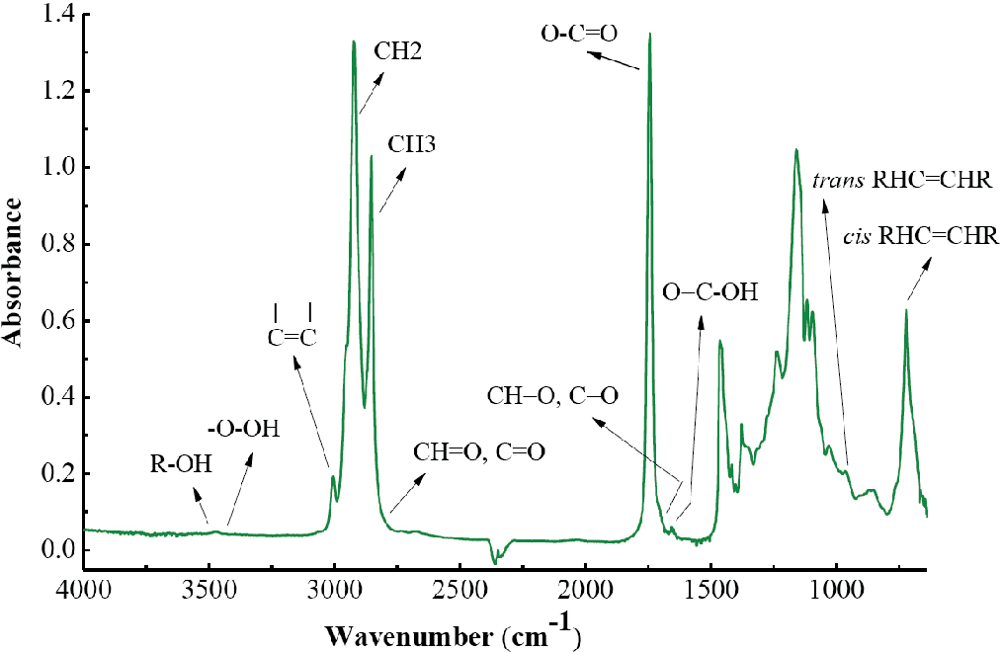
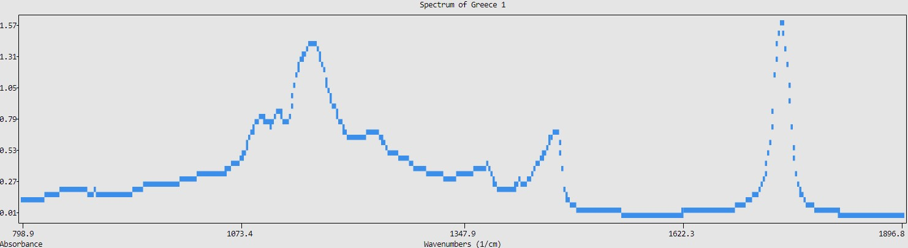
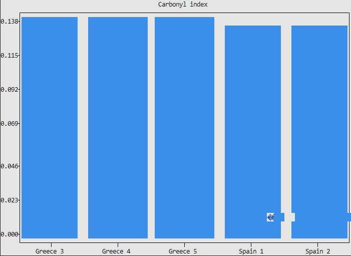

<h1>Data-Integration-template</h1>
This project was created in order for QC(quality control) labs or students to easily keep track of their Products. It will allow them to keep track of certain chemical information about their products as well as update them using an easy to use google sheets API. this example has been made to check different type of olive oils.

an FTIR(Fourier transform infrared) spectrum of olive oil with attributed band is displayd. a change in spectrum can appear depending of the olive oil itself.

<h2>Site Goals</h2>

This is a simple application to give user a template to quickly modify and quickly keep track of their data and do integration on them

<h2>Target Audience</h2>

students or QC labs to have an user friendly way to do manipilation and keep track of the chemical data of their products

<h2>User Stories</h2>

<li>As a User, I would like to be able to easily input my data in a well know 
environment which requires no/minimal training to use</li>
<li>As a User, I would like to be able to check all the data steps because this could be important in case of audit or check for mistakes</li>
<li>As a User, I would like to be able to to visualize my acquired Data</li>
<li>As a User, I would like to be able to to visualize my acquired Data to see certain trends</li>

<h3>Features Planned</h3>

<li>Simple easy to use application using a familiar environment</li>
<li>Simple storage of the data</li>
<li>Visualization of the data</li>
<li>data manipulation to give more information to the user</li>
<li>looking for trends of the last data set to see changes</li>
<h2>Structure</h2>
<h3>USER STORY</h3>
<ol>
<li>As a User, I would like to be able to easily input my data in a well know 
environment which requires no/minimal training to use</li>

</ol>

<h3>IMPLEMENTATION</h3>
<li>API to google sheets</li>

excel is a familiar environment for many user so it will be an ideal place to do this.

<li>The user will put the data as required in this application in the google sheets Raw_Data file</li><a href="">link</a>

in case a wrong data has been imported they will get a notification to alter it and the program won't run

<li>when the data has been input they just need to press "x" to run the program</li>

if the data is valid the program will run completly

<h3>USER STORY</h3>

As a User, I would like to be able to to visualize my acquired Data

<h3>IMPLEMENTATION</h3>
<li>plotting of the data that has been added to google sheets file using plotext library</li>

once the programme starts running after the data check it will plot the data 

<h3>USER STORY</h3>
<li>data manipulation to give more information to the user</li>
<li>As a User, I would like to be able to check all the data steps because this could be important in case of audit or check for mistakes</li>
<h3>IMPLEMENTATION</h3>
<li>the numpy libary is has been used to integrate the data using trap integration</li>

the Data was tested using https://www.integral-calculator.com/ and integration by hand. The function Test-Data as used

<li>Integration of certain chemical vibrations to determine the presence of oxygenated groups and the branching of the olive oils</li>

The integrations borders can be changed in the top of the program for flexibility

<li>Afterwards the integrated data is added to the Integrated_Data sheet for to see the actual integrated values</li>

this is very important to check your data and for audit purposes because the all steps can be traced back

<li>Integration of certain chemical vibrations to determine the presence of oxygenated groups and the branhing of the olive oils</li>

<li>Afterwards the Ratio Calculation are made to look at the ratio between the CH2 groups and the oxynated groups</li>

<li>This will be displayed in table format</li>

<h3>USER STORY</h3>
<li>looking for trends of the last data set to see changes</li>

<h3>IMPLEMENTATION</h3>
<li>the last 5 values will taken afterwards it will be plotted</li>
<li>The Plotext libary is used to plot the barcharts for each ratio to see a trend</li>

<h3>Error Handling</h3>

Error handling was implemented throughout the application with the use of try/except statements to handle exceptions raised for things like, NaN values, wrong data input to, to long etc,... 

<h3>Features Left to Implement</h3>
As a future enhancement, I would like to add some basic functionality to have an input using an excell file that would be unloaded and read for a more easy input.
<h2>Logical Flow</h2>
flow-chart of application:

<h2>Technologies</h2>
<ul>
<li>Python</li>

Python was the main language used to build the application.

Python packages used:

<ul>
<li>NumPy library for data integration</li>
<li>PloText library for graph plotting in the terminal</li>
<li>API to google scheets for user input</li>
<ul>
<li>Gspread</li>
<li>google.oauth2.service_account</li>
</ul>
<li>Time packages was imported to slow down the code for 5 second to not overload the API</li>
</ul>
<h2>Testing</h2>

<h3>Pep8 Validation</h3>

All python code was ran through pep8online.com validator and any warnings or errors were fixed. Code then validated successfully.

In gitpod, warning was displayed by linter that env was imported but unused. This was being used by my env.py file during local development as it contained my database configuration variables so it was in fact used and the warning was ignored.

<h3>Bugs and fixes</h3>
problem with the values of the data integration due to , seperator for values bigger then a thousand. a fix was impleted so the , seperator was removed.

<h3>unfixed bugs</h3>
Due to the problem of using the API the loop function is limited to maximum of 4 values per time due to the limit of the measurements. change to the code to have less problem with the quota of the API

<h2>Deployment</h2>
<h3>Version Control</h3>
The site was created using the Visual Studio code editor and pushed to github to the remote repository ‘history’.

The following git commands were used throughout development to push code to the remote repo:

git add <file> - This command was used to add the file(s) to the staging area before they are committed.

git commit -m “commit message” - This command was used to commit changes to the local repository queue ready for the final step.

git push - This command was used to push all committed code to the remote repository on github.

<h3>Heroku Deployment</h3>
The below steps were followed to deploy this project to Heroku:
<ul>
<li>Go to Heroku and click "New" to create a new app.</li>
<li>Choose an app name and region region, click "Create app".</li>
<li>Go to "Settings" and navigate to Config Vars. Add the following config variables:</li>
<li>PORT : 8000</li>
<li>Navigate to Buildpacks and add buildpacks for Python and NodeJS (in that order).</li>
<li>Navigate to "Deploy". Set the deployment method to Github and enter repository name and connect.</li>
<li>Scroll down to Manual Deploy, select "main" branch and click "Deploy Branch".</li>
<li>The app will now be deployed to heroku</li>
<li><a source ="" target="_blank">ToDolink</a></li>
 </ul>

<h3>Clone Locally</h3>
<ul>
<li>Open IDE of choice and type the following into the terminal:</li>
<li>git clone xxx</li>
<li>Project will now be cloned locally.</li>
<li>Open your IDE of choice (git must be installed for the next steps)</li>
<li>Type git clone copied-git-url into the IDE terminal</li>
<li>The project will now of been cloned on your local machine for use.</li>
</ul>
<h3>Credits</h3>
<h5>StackOverflow</h5>

was used for certain bug fixes which were encounterd during the programming process 

<h5>Code insitute</h5>

the code insitute curriculum was used to develop the entire application. Mainly the love-sandwiches project was great inspiration to find out how to connect the file to google sheets.<a href="github.com/Code-Institute-Solutions/love-sandwiches">link</a>

